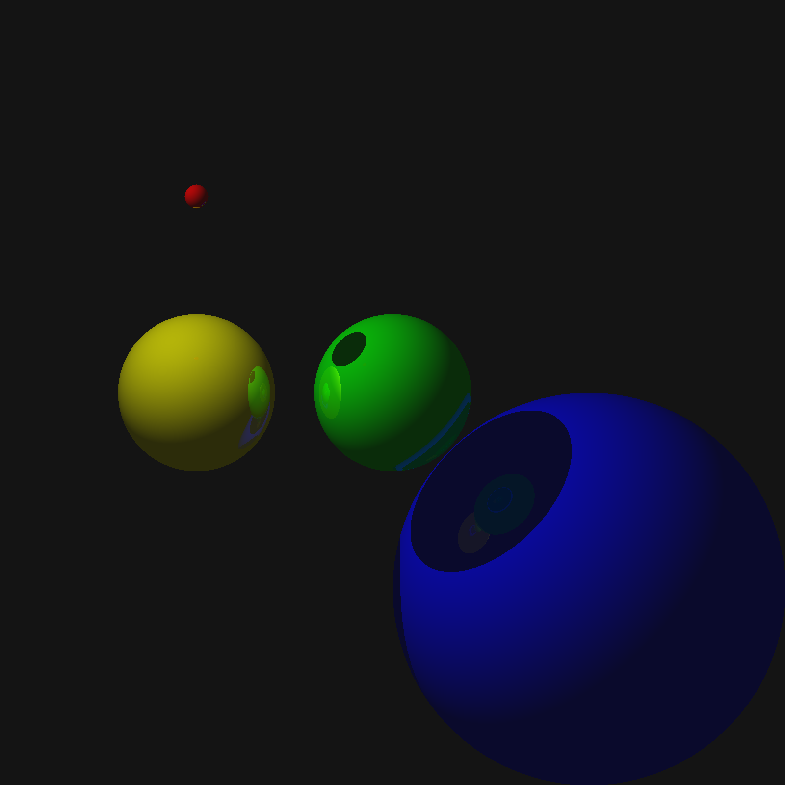

# raytracer

A basic raytracer implemented in Haskell and compiled with Stack.

##### Features...

- single light source
- sphere objects
- reflection
- shading

##### To Implement...

- parallization
- multiple light sources
- refraction
- soft shadows
- soft reflections
- perspective scaling

Example:

